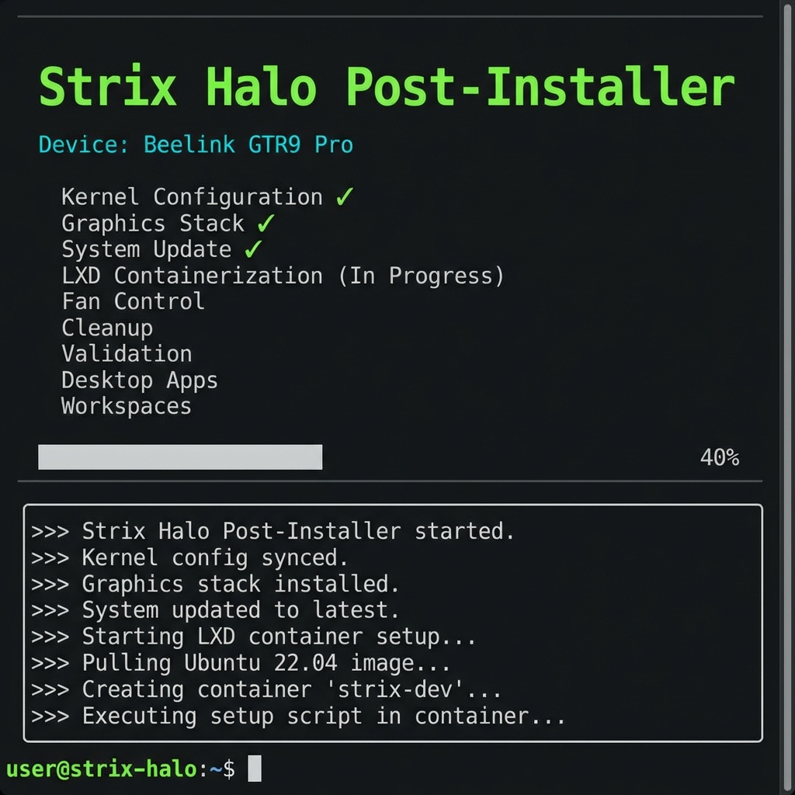
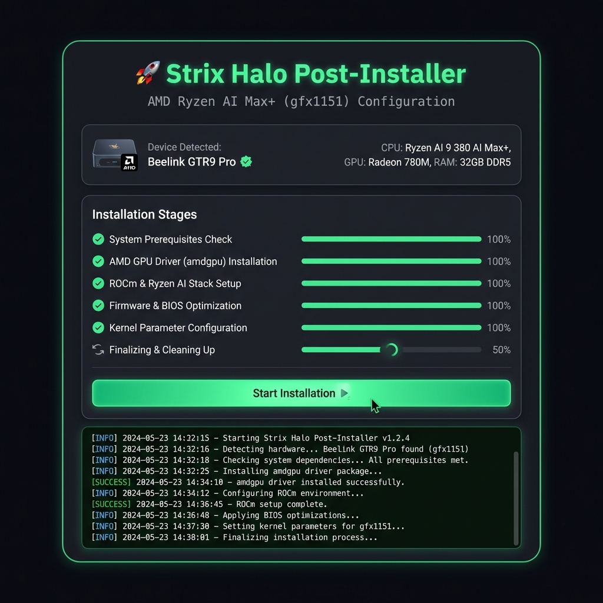

<p align="center">
  
</p>

<h1 align="center">Strix Halo Post-Installer</h1>

<p align="center">
  <strong>Automated setup for AMD Strix Halo (gfx1151) workstations on CachyOS</strong>
</p>

<p align="center">
  
  
  
</p>

---

> [!WARNING]
> **This project is under active development and not yet production-ready.**  
> Features may change, break, or be incomplete. Use at your own risk.

> [!NOTE]
> **Interested in this project?** I'd love to hear from you!  
> Open an issue or reach out if you're working with Strix Halo hardware.

---

## Screenshots

<p align="center">
  <strong>Terminal (TUI)</strong><br>
  
</p>

<p align="center">
  <strong>Web UI (Browser)</strong><br>
  
</p>

---

## Quick Install

```bash
curl -fsSL https://github.com/daveweinstein1/strix-halo-setup/releases/latest/download/strix-install -o /tmp/strix-install && chmod +x /tmp/strix-install && sudo /tmp/strix-install
```

**Options:**
```bash
sudo ./strix-install          # Auto-detect (web or TUI)
sudo ./strix-install --tui    # Force terminal mode
sudo ./strix-install --web    # Force browser mode
```

---

## Stages

| Stage | Purpose |
|-------|---------|
| Kernel Config | IOMMU, device quirks (Beelink E610 fix) |
| Graphics Setup | Mesa 25.3+, LLVM 21.x, Vulkan |
| System Update | Mirrors, packages, essentials |
| LXD Setup | Containers with GPU passthrough |
| Fan Control | lm_sensors, fancontrol (optional) |
| Cleanup | Orphan removal, cache cleanup |
| Validation | Verify kernel, GPU, LXD |
| Desktop Apps | Browsers, Office (optional) |
| Workspaces | `ai-lab`, `dev-lab` containers (optional) |

---

## Requirements (January 2026)

| Component | Required |
|-----------|----------|
| Kernel | **6.18+** |
| Mesa | **25.3+** |
| ROCm | **7.2+** |
| LLVM | **21.x** |

---

## Supported Hardware

| Device | Status |
|--------|--------|
| Framework Desktop | ✅ Full support |
| Beelink GTR9 Pro | ✅ E610 Ethernet fix applied |
| Minisforum MS-S1 Max | ⚠️ Advisory for Ethernet/USB4 |
| Other Strix Halo | ✅ Generic mode |

---

## License

**[PolyForm Strict 1.0.0](LICENSE)**

- ✅ Personal/noncommercial use allowed
- ✅ Educational and research use allowed
- ❌ Commercial use requires separate license
- ❌ Redistribution not permitted

---

<p align="center">
  <strong>Author:</strong> Dave Weinstein<br>
  <strong>Updated:</strong> January 2026
</p>
