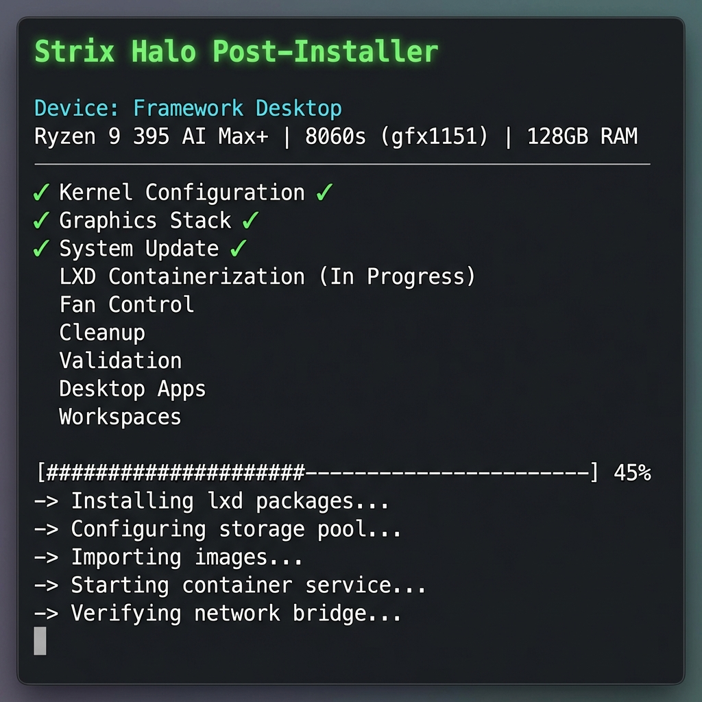

<p align="center">
  
</p>

<h1 align="center">Strix Halo Post-Installer</h1>

<p align="center">
  <strong>Automated setup for AMD Strix Halo (gfx1151) workstations on CachyOS</strong>
</p>

<p align="center">
  
  
  
</p>

---

> [!WARNING]
> **This project is under active development and not yet production-ready.**  
> Features may change, break, or be incomplete. Use at your own risk.

> [!NOTE]
> **Interested in this project?** I'd love to hear from you!  
> Open an issue or reach out if you're working with Strix Halo hardware.

---

## Screenshots

<p align="center">
  <strong>Terminal (TUI)</strong><br>
  <br>
  <em>Simulated screenshot — actual UI coming soon</em>
</p>

<p align="center">
  <strong>Web UI (Browser)</strong><br>
  <br>
  <em>Simulated screenshot — actual UI coming soon</em>
</p>

---

## Quick Install


**Short version** (via bit.ly — *coming soon*):
- **[Printable Web Guide](https://daveweinstein1.github.io/strix-halo-setup/install-guide.html)** (Recommended)
- [Text Guide](docs/INSTALL_GUIDE.md)

```bash
curl -fsSL https://bit.ly/strix-halo | sudo bash
```

<details>
<summary><strong>What does this do?</strong> (click to expand)</summary>

The short URL redirects to this bootstrap script:
```
https://raw.githubusercontent.com/daveweinstein1/strix-halo-setup/main/install.sh
```

Which does the following:
```bash
#!/bin/bash
# Downloads the installer binary from GitHub Releases
curl -fsSL "https://github.com/daveweinstein1/strix-halo-setup/releases/latest/download/strix-install" -o /tmp/strix-install

# Makes it executable
chmod +x /tmp/strix-install

# Runs the installer
/tmp/strix-install "$@"

# Cleans up
rm -f /tmp/strix-install
```

View the full script: [install.sh](install.sh)

</details>

**Direct download** (no bit.ly):
```bash
curl -fsSL https://github.com/daveweinstein1/strix-halo-setup/releases/latest/download/strix-install -o /tmp/s && chmod +x /tmp/s && sudo /tmp/s
```

**Options:** `--tui` (terminal) | `--web` (browser) | `--menu` (select stages)

---

## Stages

| Stage | Purpose |
|-------|---------|
| Kernel Config | IOMMU, device quirks (Beelink E610 fix) |
| Graphics Setup | Mesa 25.3+, LLVM 21.x, Vulkan |
| System Update | Mirrors, packages, essentials |
| LXD Setup | Containers with GPU passthrough |
| Fan Control | lm_sensors, fancontrol (optional) |
| Cleanup | Orphan removal, cache cleanup |
| Validation | Verify kernel, GPU, LXD |
| Desktop Apps | Browsers, Office (optional) |
| Workspaces | `ai-lab`, `dev-lab` containers (optional) |

---

## Why Containers?

AI and development tools are **bleeding edge** — ROCm, PyTorch, and AI coding assistants update frequently with breaking changes. We isolate these in LXD containers so:

- **Host stays stable** — Container breakage can't brick your system
- **Instant rollback** — Restore snapshots when experiments fail
- **Fresh starts** — Delete and recreate containers in minutes

📖 Full details: [Container Strategy](docs/CONTAINER_STRATEGY.md)

---

## Requirements (January 2026)

| Component | Required |
|-----------|----------|
| Kernel | **6.18+** |
| Mesa | **25.3+** |
| ROCm | **7.2+** |
| LLVM | **21.x** |

---

## Supported Hardware

| Device | Status |
|--------|--------|
| Framework Desktop | ✅ Full support |
| Beelink GTR9 Pro | ✅ E610 Ethernet fix applied |
| Minisforum MS-S1 Max | ⚠️ Advisory for Ethernet/USB4 |
| Other Strix Halo | ✅ Generic mode |

---

## License

**[PolyForm Strict 1.0.0](LICENSE.md)**

### Why This License?

We chose the [PolyForm Strict License](https://polyformproject.org/licenses/strict/1.0.0/) because:

1. **Clear terms** — Written by lawyers specifically for source-available software
2. **Personal use allowed** — You can use this for your own projects, learning, research
3. **Commercial use blocked** — Prevents unauthorized commercial exploitation
4. **Future flexibility** — We can grant additional rights without changing the license

### What's Allowed

- ✅ Personal/noncommercial use
- ✅ Private study, hobby projects, experimentation
- ❌ Commercial use (requires separate license)
- ❌ Government and nonprofit use (requires permission)
- ❌ Redistribution (requires permission)

### Commercial Licensing

**Hardware manufacturers & system integrators:** Interested in bundling this installer with your Strix Halo products? We're open to partnership discussions and commercial licensing arrangements.

👉 [Open an issue](https://github.com/daveweinstein1/strix-halo-setup/issues) with subject "Commercial License Inquiry"

---

<p align="center">
  <strong>Author:</strong> Dave Weinstein<br>
  <strong>Contact:</strong> <a href="https://github.com/daveweinstein1/strix-halo-setup/issues">GitHub Issues</a><br>
  <strong>Updated:</strong> January 2026
</p>
