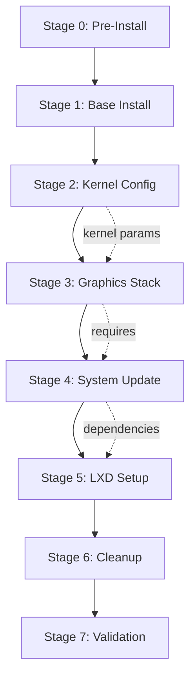

# Installation Architecture

## Philosophy

This installation guide follows a **defensive, checkpoint-based approach**:

1. **One change at a time**: Each script handles one logical stage
2. **Verify before proceeding**: Each command is confirmed and validated
3. **Fail loudly**: Errors stop execution and provide clear guidance
4. **Reproducible**: All steps are documented and scriptable
5. **Recoverable**: Rollback instructions for each stage

## Stage Dependencies



## Why CachyOS?

CachyOS was chosen for Strix Halo because:
- **Optimized kernels**: Pre-built with latest CPU microarchitecture support
- **Fast repositories**: Packages are built with `-march=native` optimizations
- **Recent packages**: Arch-based, gets latest Mesa/kernel faster than Ubuntu/Fedora
- **Performance**: Better out-of-box performance for modern AMD hardware

## Critical Technical Requirements

### gfx1150 (RDNA 3.5 - Strix Halo iGPU)

The integrated GPU in Strix Halo is very recent and requires:

| Component | Minimum Version | Recommended | Reason |
|-----------|----------------|-------------|---------|
| **Kernel** | 6.15 | 6.18 (LTS) | gfx1150 perf boost in 6.15+, 6.18 is current LTS (Nov 2025) |
| **Mesa** | 24.1 | 25.3.1 | gfx1150/1151 support in 24.1+, 25.3.1 is current (Dec 2025) |
| **LLVM** | 17 | 21.1.7 | gfx1150 backend in 17+, 21.1.7 is current (Dec 2025) |
| **linux-firmware** | 20240410 | latest | GPU microcode, use latest available from repos |

### E610 Driver Issue

**Problem**: The Intel E610 Ethernet driver (`ice` module) has known issues on certain motherboards, causing:
- Random kernel panics
- Network instability
- Boot hangs

**Solution**: Add to kernel parameters:
```
modprobe.blacklist=ice
```

This is handled in Stage 2: Kernel Configuration.

### LXD Dependency Conflicts

**Problem**: LXD on CachyOS can conflict with:
- `systemd-resolved` (DNS resolution)
- `dnsmasq` (DHCP for containers)
- Bridge networking modules

**Solution**: Stage 5 installs dependencies in specific order and configures networking properly.

## Script Architecture

Each installation script follows this pattern:

```bash
#!/bin/bash

# === STAGE N: [NAME] ===
# Purpose: [what this accomplishes]
# Dependencies: [previous stages]

set -euo pipefail  # Exit on error, undefined vars

# Logging setup
LOG_DIR="./logs"
mkdir -p "$LOG_DIR"
STAGE_LOG="$LOG_DIR/$(basename $0 .sh).log"

# Utility functions
log() { echo "[$(date +'%Y-%m-%d %H:%M:%S')] $*" | tee -a "$STAGE_LOG"; }
confirm() { 
    read -p "⏸️  $1 [y/N] " -n 1 -r
    echo
    [[ $REPLY =~ ^[Yy]$ ]]
}
check_status() {
    if [ $? -eq 0 ]; then
        log "✅ $1"
    else
        log "❌ $1 FAILED"
        log "🤖 Copy error above to AI for help"
        exit 1
    fi
}

# === COMMANDS ===
# Each command is wrapped with:
# 1. Explanation of what it does
# 2. Confirmation prompt
# 3. Execution with logging
# 4. Status check
# 5. AI help prompt on failure
```

## Package Version Strategy

To ensure gfx1150 compatibility:

1. **Use CachyOS testing repos** (if needed for bleeding-edge Mesa)
2. **Pin critical packages** to prevent downgrades:
   - `mesa`
   - `linux-firmware`
   - `vulkan-radeon`
3. **AUR packages** for any missing components
4. **Manual compilation** only as last resort

## Rollback Strategy

Each stage creates a checkpoint:

- **Stage 1**: Can boot from USB to start over
- **Stage 2**: Can edit GRUB from recovery mode
- **Stage 3-7**: Can boot to console and revert packages

Recommended: Use **btrfs** with snapshots if possible (decided in Stage 1).

## Validation Criteria

Installation is considered successful when:

- [ ] System boots without kernel parameters workarounds (except E610)
- [ ] `glxinfo | grep -i "renderer"` shows gfx1150/RADV
- [ ] `vulkaninfo` runs without errors
- [ ] LXD containers can be created and accessed
- [ ] No AI sysadmin services running
- [ ] System is stable through multiple reboots

## Future Expandability

This guide can be extended with:
- ROCm installation (for compute/AI workloads)
- Gaming optimizations (gamescope, gamemode)
- Development environment setup
- Additional container configurations

But core focus is: **stable, working Strix Halo system with proper GPU support**.
